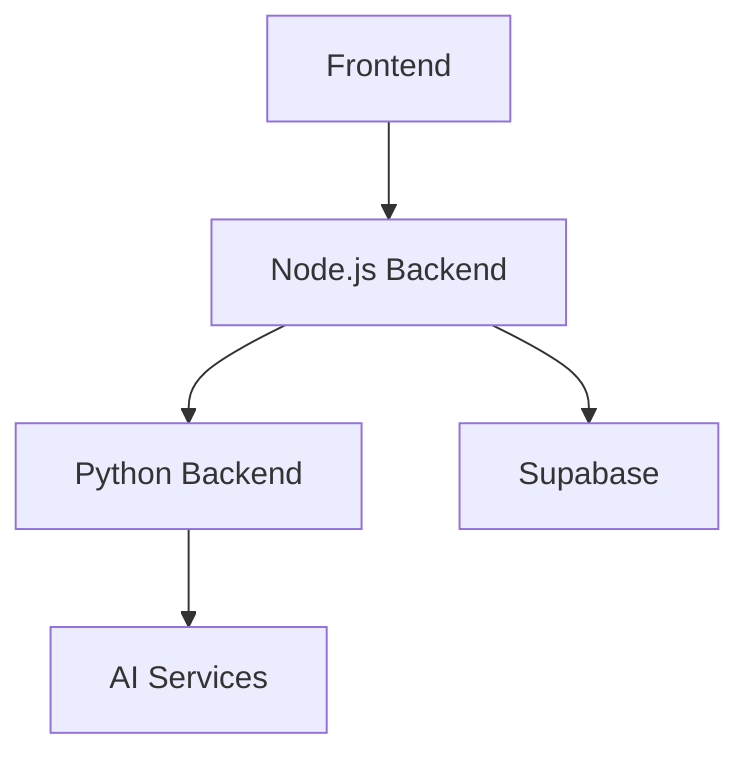

# System Patterns

## Architecture Overview
The application follows a microservices architecture with three main components:
1. Frontend (Next.js)
2. Node.js Backend (Express)
3. Python Backend (FastAPI)

## Component Relationships

## Design Patterns
1. Service Layer Pattern
   - Separation of concerns between services
   - Clear API boundaries
   - Modular AI service implementation

2. Repository Pattern
   - Database access abstraction
   - Centralized data operations
   - Consistent error handling

3. Factory Pattern
   - AI model selection and initialization
   - Service creation and configuration
   - Extensible model switching

## Technical Decisions
1. Frontend
   - Next.js for React framework
   - Tailwind CSS for styling
   - shadcn/ui for components
   - React Query for data management

2. Backend
   - Express.js for API routing
   - FastAPI for AI processing
   - Modular AI service architecture
   - Docker for containerization

3. Database
   - Supabase for PostgreSQL
   - Row-level security
   - JWT authentication

## API Design
1. RESTful endpoints
2. Consistent error responses
3. Rate limiting
4. Input validation
5. Authentication middleware

## Security Patterns
1. JWT authentication
2. API key protection
3. CORS configuration
4. Rate limiting
5. Input sanitization

## Deployment Strategy
1. Frontend: Vercel
2. Backend: fly.io
3. Database: Supabase
4. Docker containers
5. Environment-based configuration 