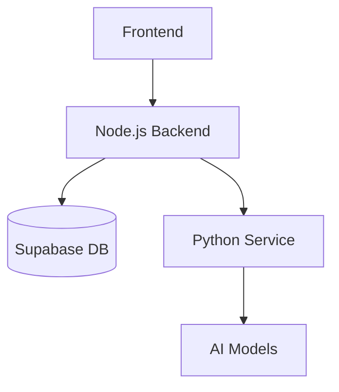

# System Patterns

## Architecture Overview

## Component Relationships

### Frontend (Next.js)
- **Page Component**
  - Handles user input
  - Manages state with React Query
  - Displays results and status

- **Providers**
  - React Query provider
  - Global state management
  - API client configuration

### Backend (Node.js)
- **API Routes**
  - `/api/process-video` - Video processing
  - `/api/summary/:videoId` - Results retrieval

- **Services**
  - VideoService - Orchestrates processing
  - YouTube metadata extraction
  - Python service communication

- **Repositories**
  - VideoRepository - Database operations
  - Data persistence patterns
  - Error handling

### Backend (Python)
- **API Endpoints**
  - `/process` - Video processing
  - `/health` - Service health check

- **Processing Pipeline**
  1. Audio download
  2. Transcription
  3. Summary generation

## Design Patterns

### Repository Pattern
- Abstracts database operations
- Centralizes data access
- Provides type safety

### Service Pattern
- Business logic encapsulation
- Cross-service communication
- Error handling

### Provider Pattern
- Global state management
- API client configuration
- React Query integration

## Data Flow
1. User submits YouTube URL
2. Frontend sends to Node.js backend
3. Node.js:
   - Validates URL
   - Creates database record
   - Sends to Python service
4. Python:
   - Downloads audio
   - Generates transcript
   - Creates summary
5. Node.js:
   - Updates database
   - Returns results
6. Frontend:
   - Polls for updates
   - Displays results

## Error Handling
1. **Frontend**
   - Form validation
   - API error handling
   - Loading states

2. **Backend**
   - Input validation
   - Service error handling
   - Database error handling

3. **Python Service**
   - Download errors
   - Processing errors
   - API errors

## Security Patterns
1. **API Security**
   - CORS configuration
   - Rate limiting
   - Input validation

2. **Data Security**
   - Secure storage
   - API key protection
   - Environment variables

## Testing Strategy
1. **Frontend**
   - Component testing
   - Integration testing
   - E2E testing

2. **Backend**
   - Unit testing
   - Integration testing
   - API testing

3. **Python Service**
   - Unit testing
   - Integration testing
   - Model testing 