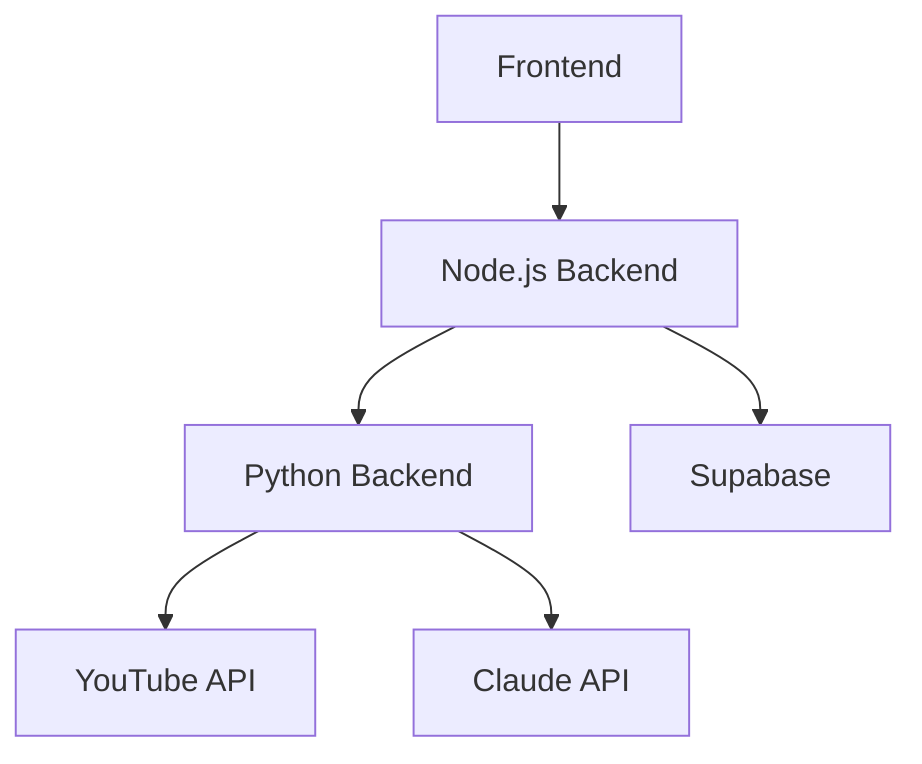

# System Patterns

## Architecture Overview


## Component Relationships
1. **Frontend (Next.js)**
   - React Query for data fetching
   - Polling mechanism for status updates
   - TypeScript for type safety
   - Tailwind CSS for styling

2. **Node.js Backend**
   - Express.js for API routing
   - Repository pattern for database access
   - Service layer for business logic
   - Background processing for video analysis

3. **Python Backend**
   - FastAPI for API endpoints
   - yt-dlp for video processing
   - Claude API for summarization
   - Async processing for long-running tasks

4. **Database (Supabase)**
   - PostgreSQL for data storage
   - Separate tables for videos, transcripts, and summaries
   - Foreign key relationships
   - Timestamps for tracking

## Design Patterns
1. **Repository Pattern**
   - Abstract database operations
   - Centralize data access logic
   - Handle database errors consistently

2. **Service Layer Pattern**
   - Business logic encapsulation
   - Cross-cutting concerns
   - Error handling and logging

3. **Background Processing**
   - Asynchronous task handling
   - Status tracking
   - Error recovery

4. **Polling Pattern**
   - Status updates
   - Progress tracking
   - Real-time UI updates

## Data Flow
1. **Video Processing**
   ```
   Frontend -> Node.js -> Python -> YouTube -> Claude -> Supabase -> Frontend
   ```

2. **Status Updates**
   ```
   Frontend -> Node.js -> Supabase -> Frontend
   ```

## Error Handling
1. **Frontend**
   - React Query error states
   - User-friendly error messages
   - Loading states

2. **Backend**
   - Try-catch blocks
   - Error logging
   - Status tracking

## Security Patterns
1. **API Security**
   - Environment variables
   - API key protection
   - Input validation

2. **Data Security**
   - Database constraints
   - Type safety
   - Error handling

## Testing Strategy
1. **Frontend**
   - Component testing
   - Integration testing
   - E2E testing

2. **Backend**
   - Unit testing
   - Integration testing
   - API testing

3. **Python Service**
   - Unit testing
   - Integration testing
   - Model testing 